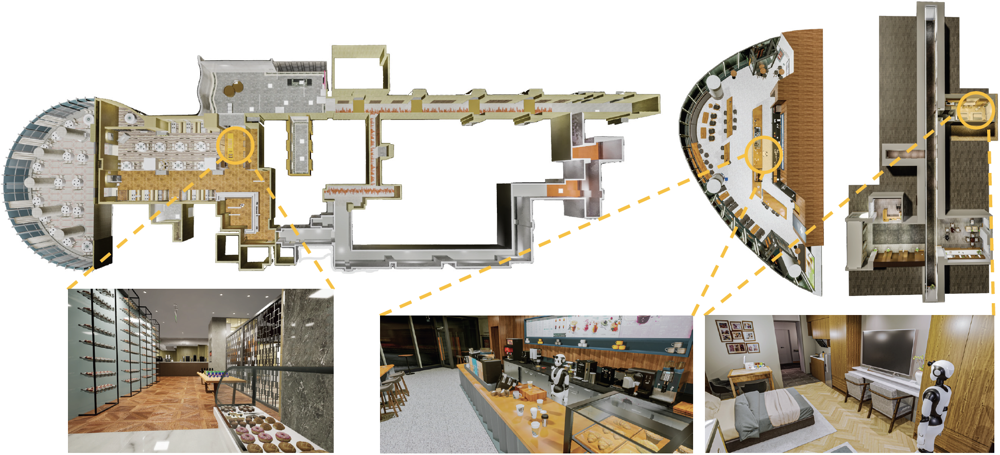
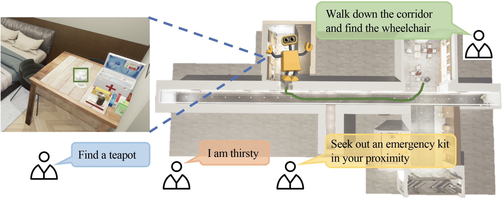

# MEFV-LN:

This GitHub repository is for the MBZUAI AI701 course, implementation of [MEFV-LN].

--------


## Overview
MEFV-LN: provides four tasks: 1) goal-conditioned navigation given a specific object category (e.g., "fork"); 2) goal-conditioned navigation given simple instructions (e.g., "Search for and move towards a tennis ball"); 3) step-by-step instruction following; 4) finding abstract object based on high-level instruction (e.g., "I am thirsty"). The earlier version of our simulator covers three high-quality scenes: cafe, restaurant, and nursing house.






## Installing Dependencies
- Installing [GLIP](https://github.com/microsoft/GLIP).

- Installing [Grounded-SAM](https://github.com/IDEA-Research/Grounded-Segment-Anything).


## Setup
Clone the repository and install other requirements:
```
git clone https://github.com/Leo-Yuyang/MEFV-LN:.git
cd MEFV-LN:/
pip install -r requirements.txt
```
